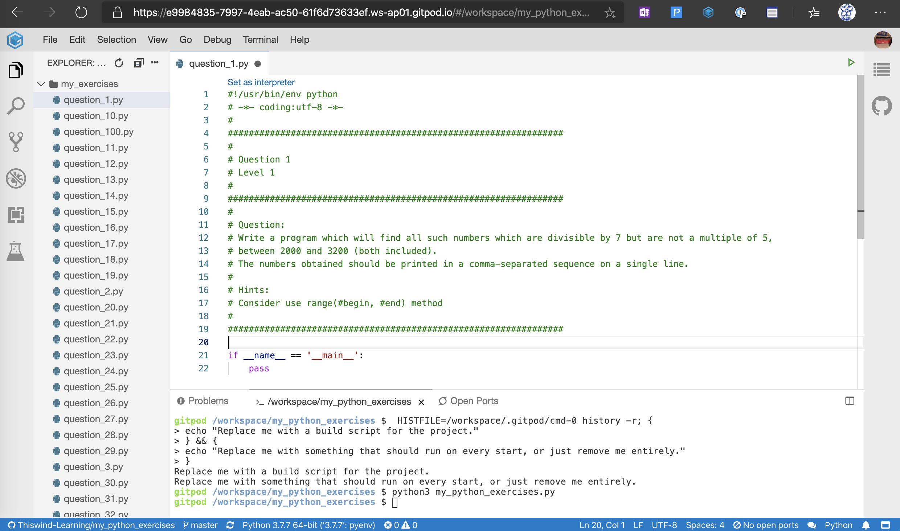

[](https://gitpod.io/#https://github.com/Thiswind-Learning/my_python_exercises) 

# my_python_exercises

[zhiwehu/Python-programming-exercises](https://github.com/zhiwehu/Python-programming-exercises)是一个有8.4K Star的项目。
为了方便刷里面的练习题，本项目编写了这个刷题程序。
本项目读取zhiwehu/Python-programming-exercises当中的练习题，为每一道题创建一个独立的Python文件并且把题目内容写到注释当中，方便刷题。


## Usage（Gitpod在线编辑）

点击此按钮 --> [](https://gitpod.io/#https://github.com/Thiswind-Learning/my_python_exercises) 

根据提示注册Gitpod即可。




## Usage（克隆到本地）

### 克隆本项目

```bash
git clone https://github.com/Thiswind-Learning/my_python_exercises.git
cd my_python_exercises
git submodule update --init --recursive
```

### 创建题库


```bash
python3 my_python_exercises.py
```

>注意：每次执行此命令，题库就会被删除重建

### 查看题目

在`my_exercises`目录下，根据[100+ Python challenging programming exercises](https://github.com/zhiwehu/Python-programming-exercises)创建题库

```bash
cd my_exercises
ls -l
```

#### 对答案

请查看：[参考答案](https://github.com/zhiwehu/Python-programming-exercises/blob/master/python%20contents.txt)

